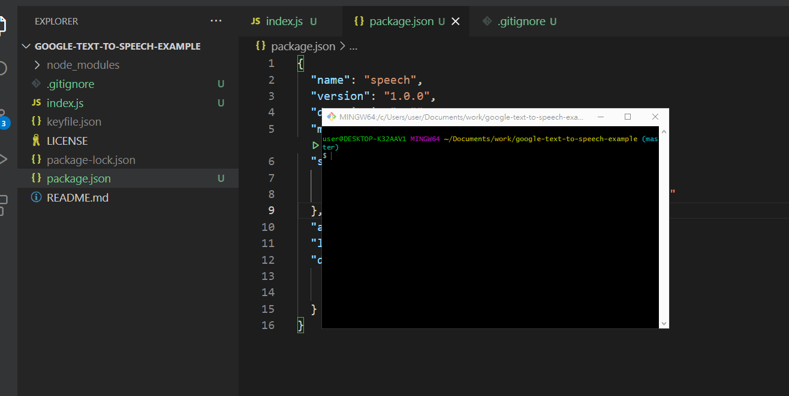

# google-text-to-speech-example
google-text-to-speech-example

### Start
```
change to your google application key.
const projectId = 'projectId' 
const keyFilename = 'keyfile.json'

npm i
npm start
```

### DEMO

